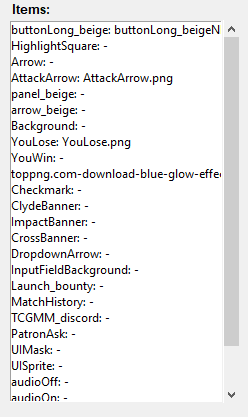
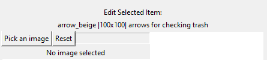
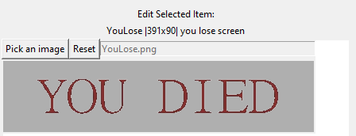
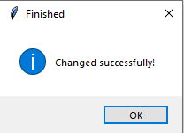

# OPTCG Asset Changer

A tool for modifying textures in the OPTCGSim

- [Download](https://github.com/maksmaksmaksmaksmaks/OPTCG-Asset-Changer/releases)
- [Examples](markdowns/Examples.md)
---
# Instructions
## 1. Setup
Place the `AssetChangerGUI.exe` next to your `OPTCGSim.exe` file:
```
Your Game Folder/
├── OPTCGSim.exe
└── AssetChangerGUI.exe
```
[Detailed instructions](markdowns/Detailed.md)

---
## 2. Instructions for use
### 1. Run the AssetChangerGUI.exe
The first time it is going to create a backup and some folders

---

### 2. Select what you want to change

Pick an asset to change on the left side



Your selected asset shows up on the right


---

### 3. Pick your images
Open the explorer with the button and pick your image

It will show up on the preview 



Repeat the process for all the assets you want to change

---

### 4. Make changes
- Press the green button at the bottom to make changes
- If everything worked you will get a popup like this


---

### 5. Link to latest release
- [Download](https://github.com/maksmaksmaksmaksmaks/OPTCG-Asset-Changer/releases)

---

#### Important Notes
- There is a good chance windows defender will flag it as a virus (More info -> Run anyway)
- 1st time launching the sim after changes takes a bit longer
- The tool will save your original assets file in the backup folder
- To revert all changes you need to take the ```sharedassets1.assets``` from ```BACKUP_ASSETS``` and put it into the ```OPTCGSim_Data``` folder
- [instructions for manual use](/markdowns/OLD_instrucitons.md)
- Any problems or questions? dm me on discord ```praprotnikova4``` 

---

**make it look pretty :3**  
