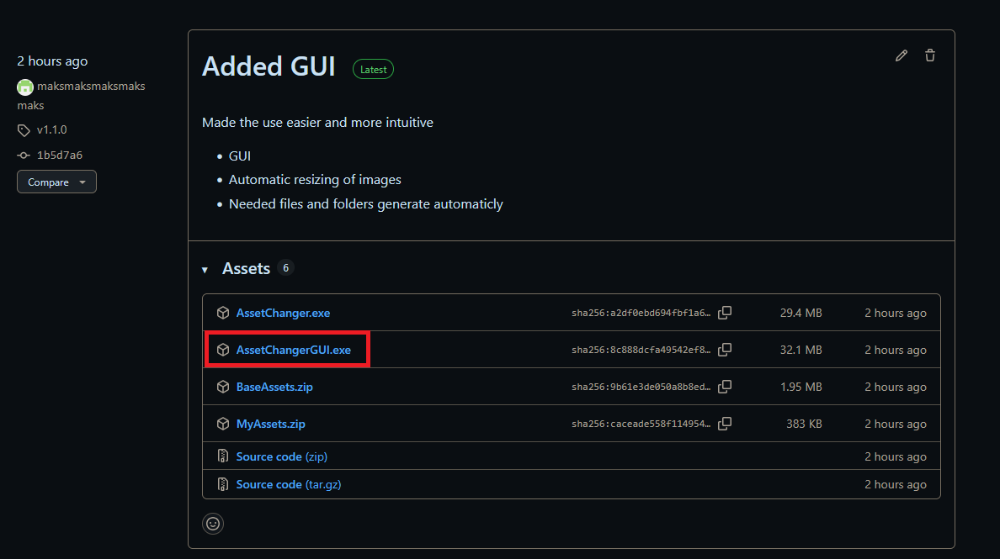
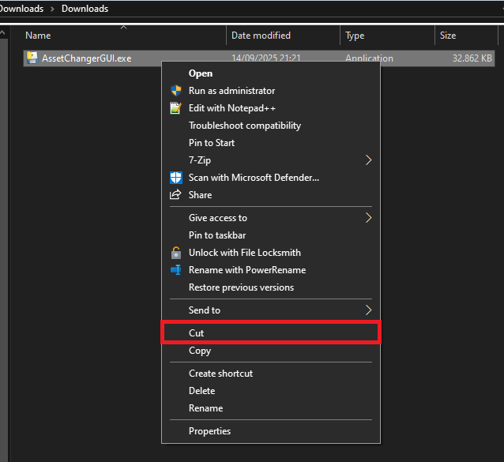
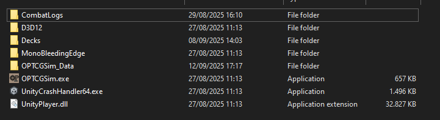
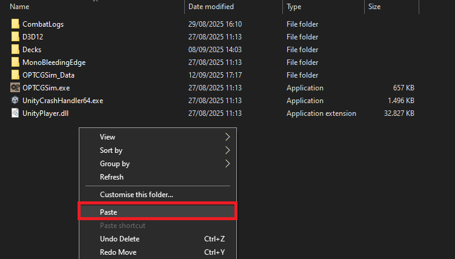

# Detailed Instructions
## 1. First download the ```AssetChangerGUI.exe```
- Open [THIS](https://github.com/maksmaksmaksmaksmaks/OPTCG-Asset-Changer/releases) link
- On the latest release find ```AssetChangerGUI.exe```


- It should be in your Downloads folder


## 2. Cut it from Downloads
- Right click it and pick cut (copy also works)


## 3. Find your game folder
- The one you start the game from
- It should look something like this


## 4. Paste it in 
- Right click into the folder and pick paste


## 5. Run it
- Double-click the newly created ```AssetChangerGUI.exe```
- It will get flagged as unsafe since i am an unknown publisher (More info -> Run anyway)


